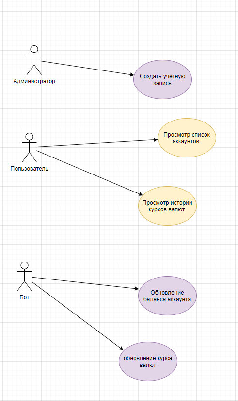
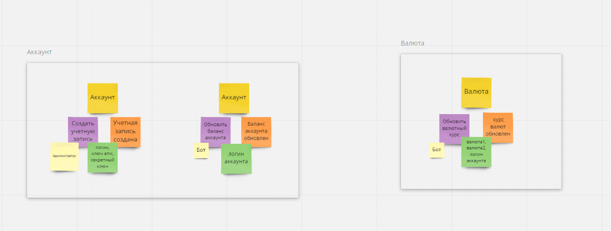

## Задание
1. Разработать систему позволяющую добавить учетную запись указав логин, ключ апи, секретный ключ. Получить можно на сайте https://localbitcoins.net
2. Создать автоматическое обновление баланса аккаунта раз в 60 сек. и обновлять курс валюты раз в 10сек, bitcoin/usd используя формулу расчета max(bitstampusd_avg,bitfinexusd_avg)*usd_in_rub, используя запросы к REST Api. См.документацию апи.
3. Вывести на главной странице, в таблице, список аккаунтов и курсы валют.

## Проектируем




## Что получилось

1. Добавление учетной записи
```
$ ./bin/app.php add-account -l usertest -k f0526e7bbf9af67436743674367 -s a380b63ef2af5ec28c4cc251cc4eab2e1gdsh6437373850a34244d2b7c1
```

2. Синхронизация баланса и курсов
```
$ ./bin/app.php sync-balance -l usertest
```
3. Вывод таблицы аккаунтов и курсов на главной странице
https://yadi.sk/i/vKOEbSZHfeICDA

- Domain - доменная модель и бизнес логика доменной модели, (сущности, коллекции, сервисы, объекты значения, объекты транспортировки)
- Аpplication - приложение и ее бизнес логика (контроллеры, вьюхи, сервисы, хелперы, модули и тд)
- Infrastructura - реализации контрактов доменных моделей, контрактов приложения, адаптеры, драйверы и тд
